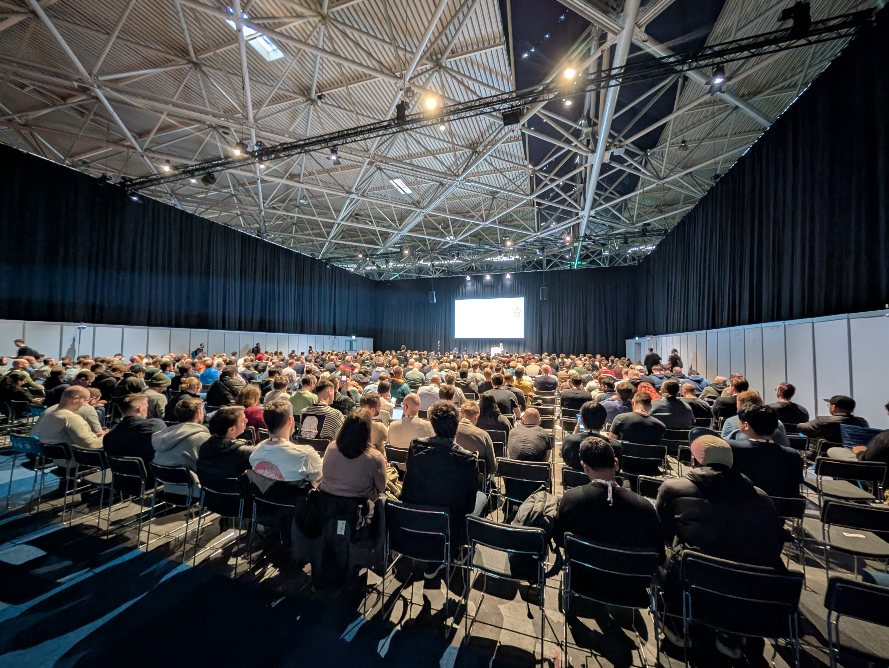
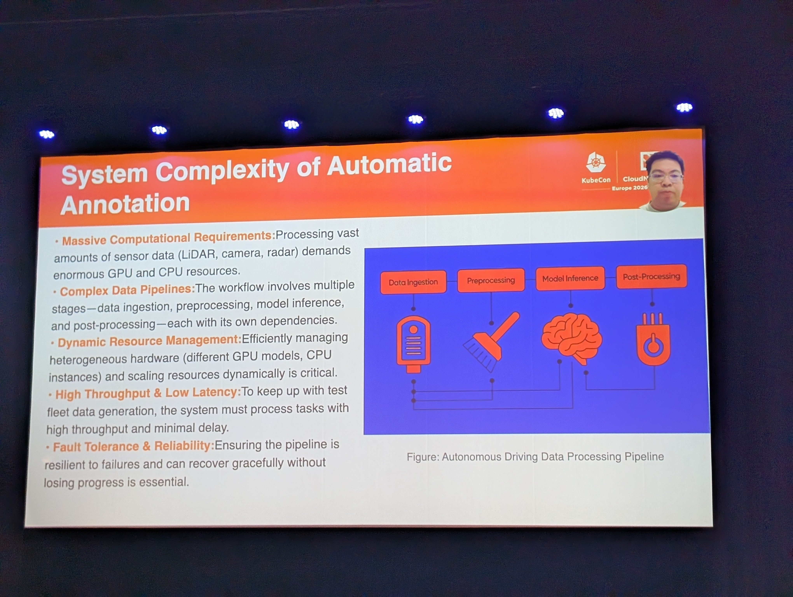
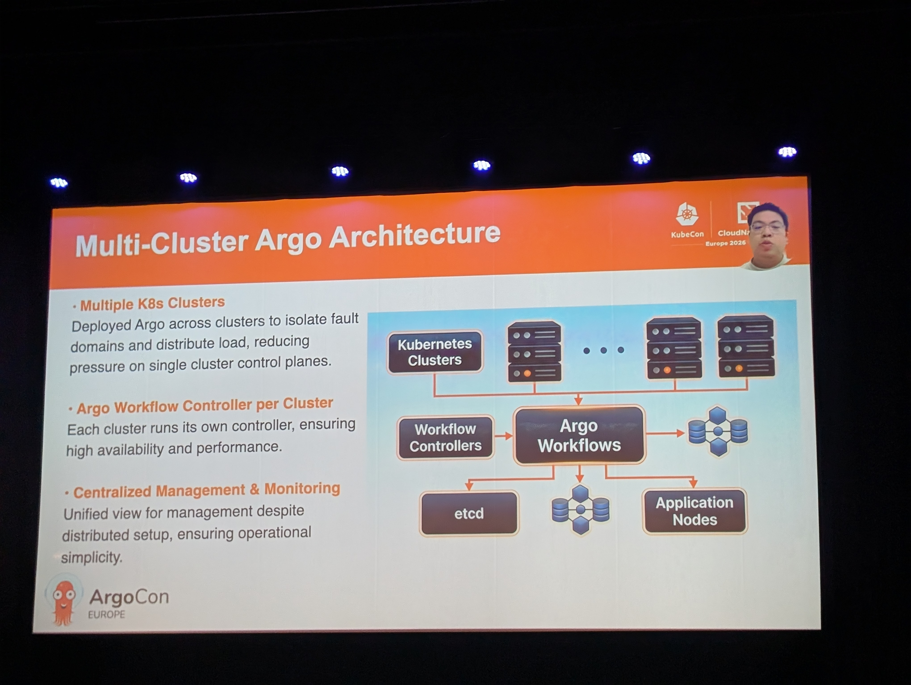
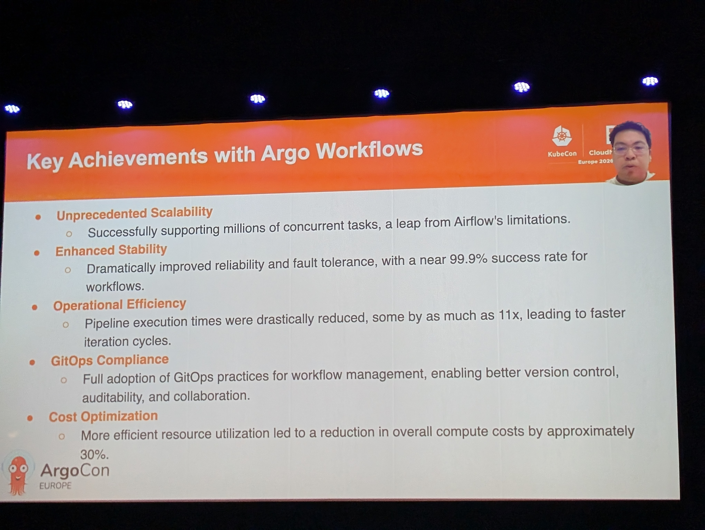
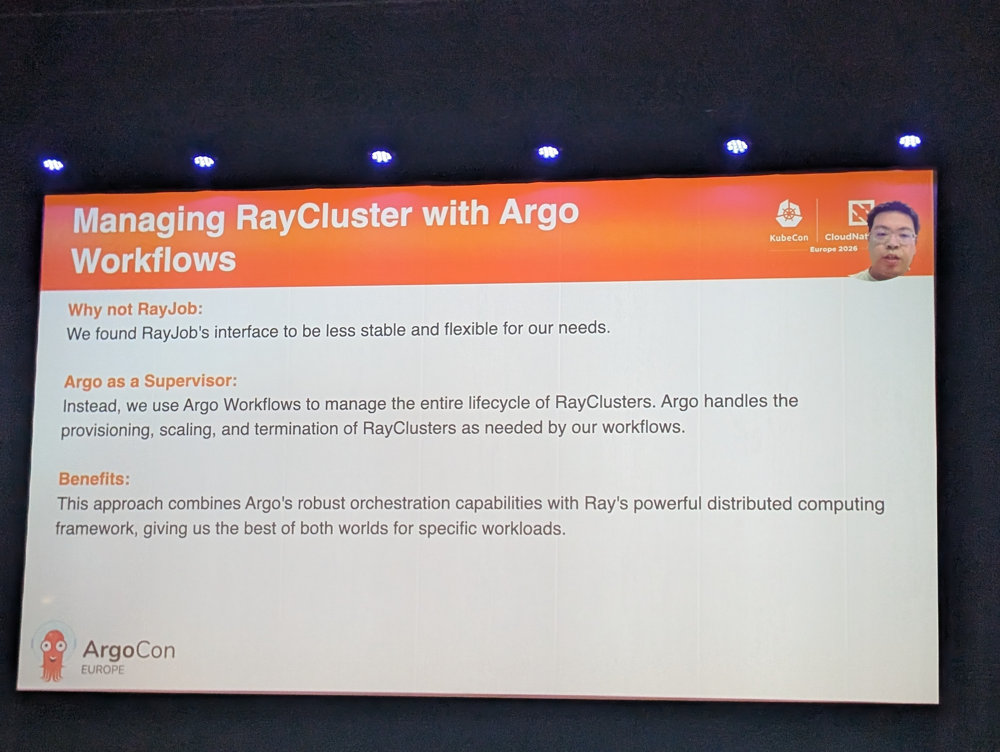
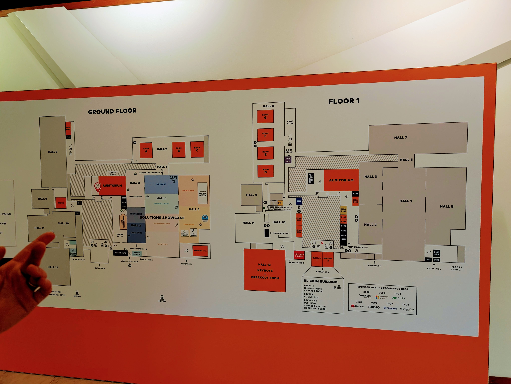
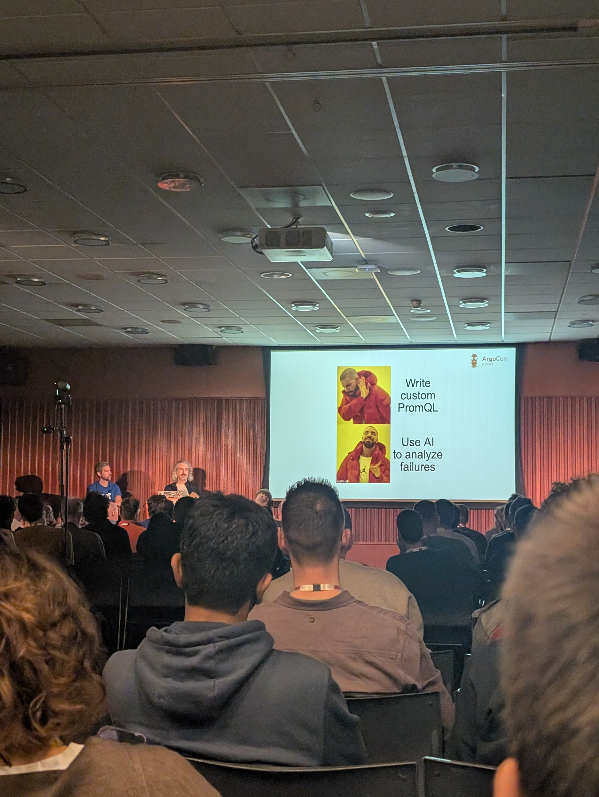
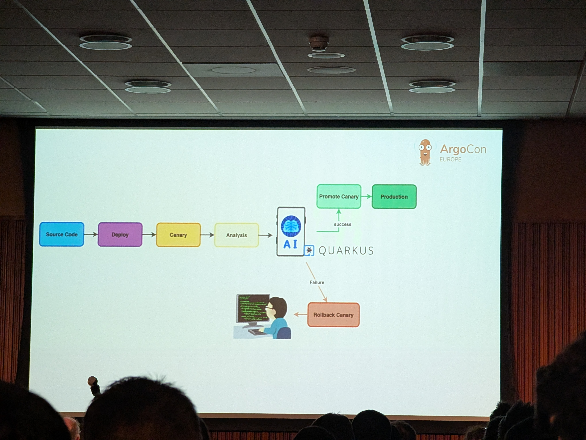
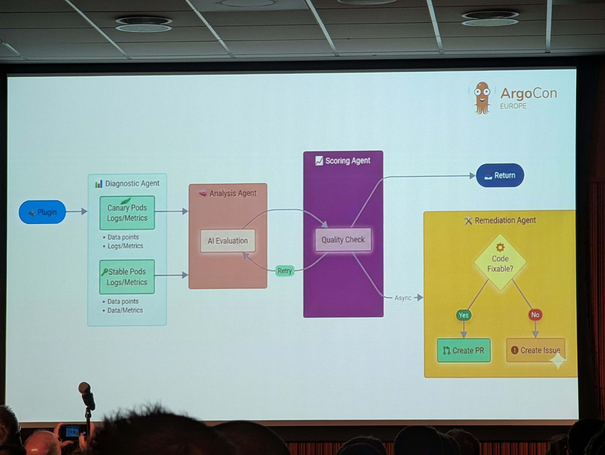
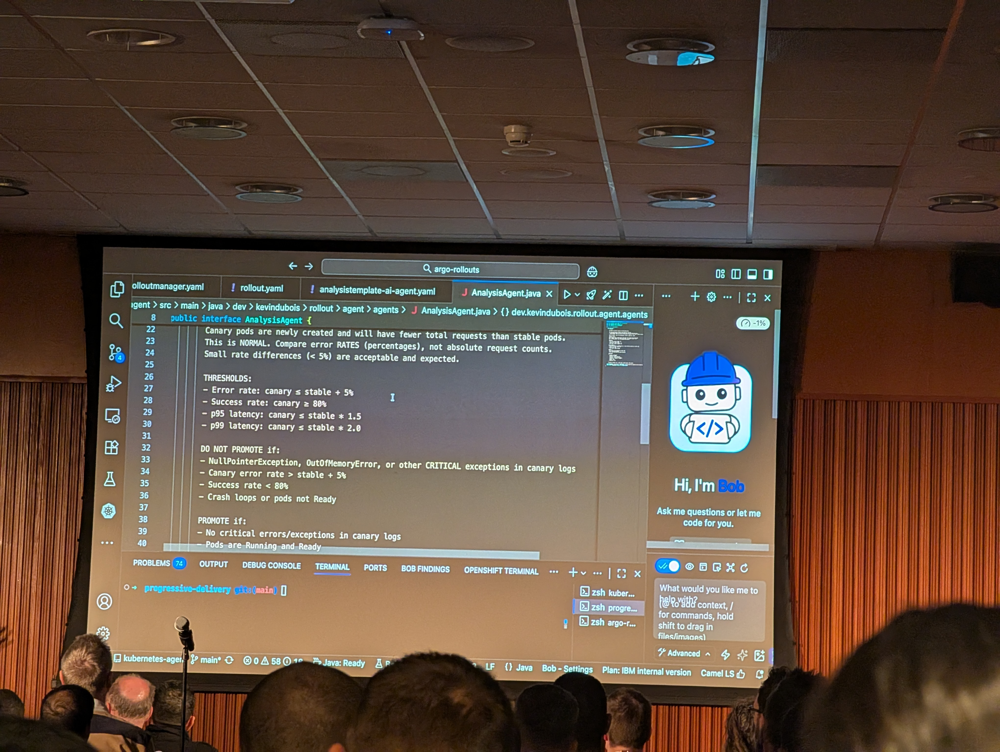

# kubecon2026
Notes from the KubeCon Europe 2026 in Amsterdam


I had the chance to attend the KubeCon in beautiful Amsterdam from 23–26 March 2026. Here I share some notes about the conference - to remember myself, and also for your pleasure.

## TLDR;

* Platform Engineering ain't dead - it matured and the most successful framework here is Crossplane (it's basically everywhere)
* Argo Workflows is a thing (and it scales much better than Apache Airflow)
* [LangChain4j](https://github.com/langchain4j/langchain4j) was used in so many live demos that I would argue it's time to have a look into it!


## Wait: Platform Engineering ain't dead! (Mo 23.03.2026)

The first thing I noticed at KubeCon: There were multiple pre conference days like ArgoCDCon, BackstageCon Platform Engineering Day (among many others), that featured all things Platform Engineering. The rooms boasted from people:



I guess sometimes in the Gardner Hypecycle's Trough of Disillusionment right before the topics finally pleateaus people think the hype is dead. But it is not, it's beeing really adopted.

## Empowering Autonomy: BYD's Journey Taming Million-Task Scale With Argo Workflows - Shuangkun Tian, Alibaba Cloud & Zhang Bao, BYD

[link to talk](https://colocatedeventseu2026.sched.com/event/2DY2f/empowering-autonomy-byds-journey-taming-million-task-scale-with-argo-workflows-shuangkun-tian-alibaba-cloud-zhang-bao-byd) | [slides](docs/empowering-autonomy-byd-journey-taming-million-task-scale-with-argo-workflows.pdf)

A really interesting talk: It's not common to see setups at this scale like BYD's! [Argo Workflows](https://argoproj.github.io/workflows/) was somewhere deep down my TODO list, but this talk spontaneously popped it way higher: Zhang Bao from BYD showed why they migrated away from [Apache Airflow](https://airflow.apache.org/), since they had many issues as massive scale - and found a rock solid platform with Argo Workflows, featuring petabytes of data a day (easily generated by BYD's car fleet).



The architecture with Argo Workflows looked like this: 


...and the key achievements:


They also integrated [Ray is a unified framework for scaling AI and Python applications](https://github.com/ray-project/ray) and let ArgoWorkflows act as the supervisor for their RayClusters:



## Amsterdam RAI event center: A really big conference venue

Just as a side note: This years KubeCon EU used the [RAI conference center](https://www.rai.nl/en) in the south of Amsterdam - it was a HUUUGE venue, we had to walk a lot (which was something my fitness watch really liked). But sometimes you missed parts of talks because you simply couldn't make it on time:



## Beyond Argo Rollouts: Boosting Developer Experience With Intelligent AIOps - Carlos Sanchez, Adobe & Kevin Dubois, IBM

[link to talk](https://colocatedeventseu2026.sched.com/event/2DY3U/beyond-argo-rollouts-boosting-developer-experience-with-intelligent-aiops-carlos-sanchez-adobe-kevin-dubois-ibm) | [slides](docs/ArgoCon-EU26-kevin-dubois-carlos-sanchez.pdf) | [demo GitHub link](https://github.com/kdubois/argo-rollouts-quarkus-demo)

A really cool talk! I loved the idea to enhance [ArgoCD Rollouts](https://argoproj.github.io/rollouts/) with AI. I'm a fan of the concept behind Rollouts - but always thought, that it's hard to create the analysis part for when the rollout should be rolled back just based on some Prometheus metrics. Because that postpones the problem into how to craft good enough metrics... 



Instead the idea is to use AI in order to analize, if a canary deployment should be rolled back:



The speakers maintain a Argo Rollouts metric plugin called [rollouts-plugin-metric-ai](github.com/argoproj-labs/rollouts-plugin-metric-ai), which you need to configure in the Argo Rollouts `RolloutManager`:

```yaml
apiVersion: argoproj.io/v1alpha1
kind: RolloutManager
metadata:
  name: argo-rollouts
spec:
  plugins:
    metric:
    - name: argoproj-labs/metric-ai
      location: https://github.com/argoproj-labs/rollouts-plugin-metric-ai/releases/download/v0.0.1/rollouts-plugin-metric-ai-linux-amd64
      canary:
        analysis:
          startingStep: 1
          templates:
          - templateName: canary-analysis-ai-agent
        canaryMetadata:
          labels:
            role: canary
        stableMetadata:
          labels:
            role: stable
```

And the Argo Rollouts `AnalysisTemplate` looks like this:

```yaml
apiVersion: argoproj.io/v1alpha1
kind: AnalysisTemplate
metadata:
  name: canary-analysis-ai-agent
spec:
  metrics:
  - interval: 10s
    name: success-rate
    provider:
      plugin:
        argoproj-labs/metric-ai:
          agentUrl: http://kubernetes-agent:8080
          stableLabel: role=stable
          canaryLabel: role=canary
          extraPrompt: ignore aesthetic changes
    successCondition: result > 0.50
``` 

The full architectural overview covers multiple agents that work together! First you have the Analysis Agent that checks the deployment. Than you have the Scoring Agent to quality check the analysis and also a Remediation Agent to try to fix the code automatically (incl. creating a PR):



The talk also featured a live demo https://github.com/kdubois/argo-rollouts-quarkus-demo which is based on Java/Quarkus leveraging [LangChain4j](https://github.com/langchain4j/langchain4j) (which was used quite often in live demos at KubeCon 2026 I would say). The skills where shown in the demo, but I didn't find them on the repo:



The full demo script is also available: https://github.com/kdubois/argo-rollouts-quarkus-demo/blob/main/DEMO_SCRIPT.md

The demo project uses the kubernetes-agent project by Carlos Sanchez https://github.com/carlossg/kubernetes-agent

The lessons leared:

- Performance was an interesting challenge
- Went from one AI service to agentic system: parallel & async agents
- LLM choice + "context engineering" + tool calling
- Especially for PR creation
- Complexity vs portability
- Could've used Serverless MCP, external code assistant for PR creation, async remote agents, etc.